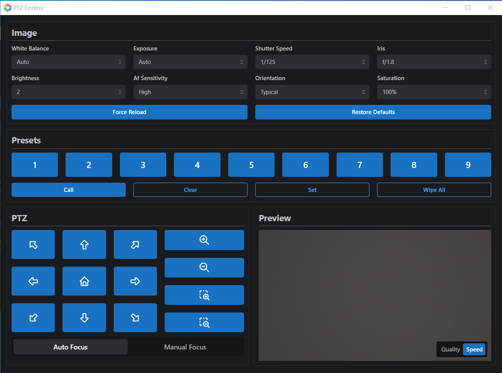

# PTZ Control

A simple but powerful all-in-one controller for IP PTZ cameras using VISCA and FFMPEG!

Download for free at [ptzcontrol.com](https://ptzcontrol.com)

  

## About

PTZ Control was created to be a more powerful and stable replacement to the PTZOptics control application. Despite working _most_ of the time, the PTZOptics software proved to be unreliable with random crashes and glitches - the last thing you want during a live broadcast. Additionally, while the PTZOptics software _technically_ supports image settings and xbox control, their implementations leave a lot to be desired. Not only does PTZ Control fix these issues, it also has other unique features like an ultra-low latency mode that beats even NDI for realtime viewing.

## How it Works

1. The electron main process loads renderer windows with the React "frontend" using IPC to communicate between the two
2. Settings are stored on the "frontend" using the localStorage API and browser events to keep in-sync
3. Newly launched cameras create additional "frontend" windows and "backend" instances of the camera class
4. Sony VISCA commands are sent over IPC and then dispatched to the cameras via UDP on port 1259 for control
5. Video is received over RTSP using FFMPEG and transcoded to MJPEG where the JPEG frames are sent to the "frontend" over IPC

## Usage

Pre-compiled binaries for each push are available via the [GitHub actions](https://github.com/tobythomassen/ptz-control/actions) automatic builds or through the verified [releases](https://github.com/tobythomassen/ptz-control/releases/latest).

Alternatively, you can build your own binaries `npm run build` after installing Node.JS and the required packages.

## License

This project is licensed under the terms of the GNU AGPLv3 license

See [LICENSE](LICENSE) for more information.
